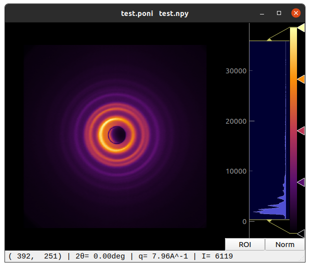

## PoniView

This is a small GUI application for loading diffraction images and pyFAI's poni files. The GUI allows for simple image display manipulation and shows information about pixel that is hovered by the cursor. Namely, x and y, scattering angle 2 Theta, scattering vector q and pixel intensity I.

## installation

The package can be installed with `pip install git+https://github.com/kremeyer/py_PoniView --no-binary=:all:`
and uninstalled with `pip uninstall PoniView`.

## usage

To run the application simply run `python -m PoniView`.
possible command line arguments are:
- `-i [filename]` to specify and image to load
- `-p []` to specify a poni-file to load

To change the image or poni-file simply drag and drop the new files onto the application.
